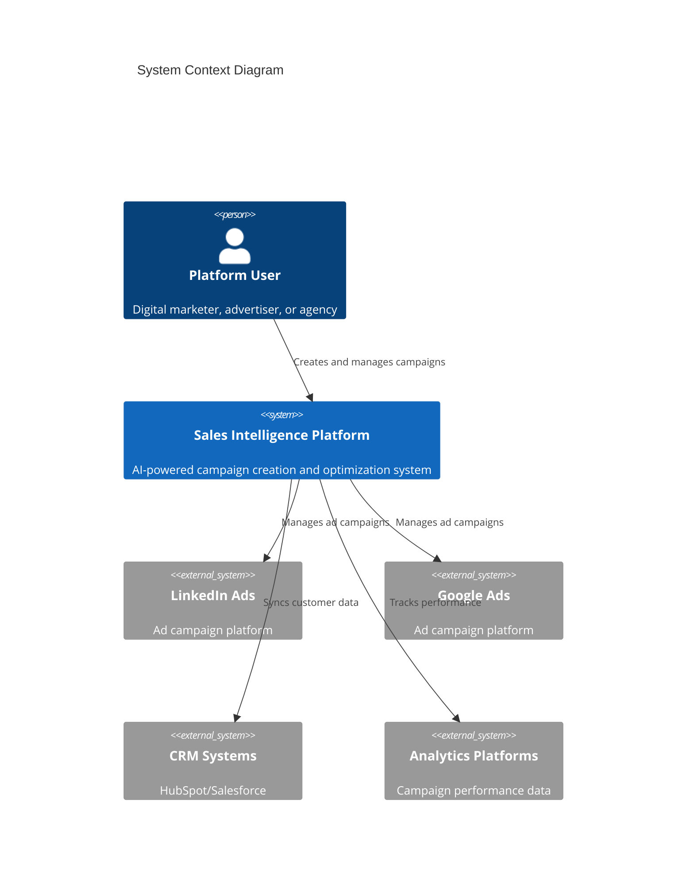

# Sales Intelligence Platform

AI-powered digital advertising campaign management platform that revolutionizes campaign creation and optimization across LinkedIn Ads and Google Ads platforms.

## Overview

The Sales Intelligence Platform is an enterprise-grade solution that addresses the complex, time-consuming process of creating effective advertising campaigns by automating campaign structure generation, audience targeting, and performance optimization.

### Key Features
- AI-powered campaign structure generation
- Multi-platform campaign management (LinkedIn & Google Ads)
- Real-time performance analytics and optimization
- Secure authentication and authorization
- Comprehensive monitoring and observability

### Performance Metrics
- Campaign creation time reduction: 80%
- Campaign performance improvement: 40%
- Target response time: <100ms
- System availability: 99.9%

## Architecture

### System Components


### Technology Stack
- **Frontend**: Next.js 14.0.0, React 18.2.0, TypeScript 5.0.0
- **Backend**: Node.js 18 LTS, Python 3.11+
- **Database**: PostgreSQL 15+
- **Cache**: Redis 7.0+
- **Infrastructure**: AWS EKS, Terraform
- **Monitoring**: Prometheus, Grafana, ELK Stack

## Getting Started

### Prerequisites
- Node.js >= 18.0.0
- Docker >= 24.0.0
- AWS CLI v2.0+
- kubectl v1.27+
- Terraform v1.5.0+

### Installation

1. Clone the repository:
```bash
git clone <repository_url>
cd sales-intelligence-platform
```

2. Install dependencies:
```bash
# Backend services
cd src/backend
npm install

# Frontend application
cd src/web
npm install
```

3. Configure environment variables:
```bash
# Backend services
cp .env.example .env

# Frontend application
cp .env.local.example .env.local
```

4. Start development environment:
```bash
# Start backend services
docker-compose up -d

# Start frontend application
cd src/web
npm run dev
```

## Development

### Project Structure
```
├── src/
│   ├── backend/           # Backend microservices
│   │   ├── api-gateway/   # API Gateway service
│   │   ├── auth-service/  # Authentication service
│   │   ├── ai-service/    # AI/ML service
│   │   └── shared/        # Shared utilities and types
│   └── web/              # Frontend application
├── infrastructure/       # Infrastructure as Code
│   ├── terraform/       # Terraform configurations
│   └── docker/          # Docker configurations
└── docs/               # Documentation
```

### Available Commands
```bash
# Development
npm run dev          # Start development server
npm run build        # Build production bundle
npm run test         # Run tests
npm run lint         # Run linting

# Infrastructure
terraform init       # Initialize Terraform
terraform plan      # Preview infrastructure changes
terraform apply     # Apply infrastructure changes
```

## Deployment

### Production Deployment
1. Build application:
```bash
npm run build
```

2. Deploy infrastructure:
```bash
cd infrastructure/terraform/aws
terraform init
terraform apply
```

3. Deploy application:
```bash
kubectl apply -f k8s/
```

### Environment Configuration
Required environment variables:
- `NODE_ENV`: Environment (development/staging/production)
- `AWS_REGION`: AWS region for deployment
- `DB_HOST`: PostgreSQL database host
- `REDIS_HOST`: Redis cache host
- `API_KEY`: Platform API key

## Security

### Security Features
- JWT-based authentication with refresh tokens
- Role-based access control (RBAC)
- API rate limiting
- Data encryption at rest and in transit
- Regular security audits

### Compliance
- GDPR compliance
- SOC 2 compliance
- Platform-specific policy compliance
- Regular security assessments

## Monitoring

### Observability Stack
- Prometheus for metrics collection
- Grafana for visualization
- ELK Stack for log aggregation
- Jaeger for distributed tracing

### Health Checks
- `/health` endpoint for each service
- Kubernetes liveness/readiness probes
- Automated alerting
- Performance monitoring

## Support

### Documentation
- [API Documentation](docs/api/README.md)
- [Architecture Guide](docs/architecture/README.md)
- [Deployment Guide](docs/deployment/README.md)
- [Security Guide](docs/security/README.md)

### Contributing
1. Fork the repository
2. Create a feature branch
3. Submit a pull request

### License
Proprietary - All rights reserved