# Technical Specifications

# 1. INTRODUCTION

## 1.1. EXECUTIVE SUMMARY

The Sales and Intelligence Platform is an AI-powered solution designed to revolutionize digital advertising campaign creation and management across LinkedIn Ads and Google Ads platforms. The system addresses the complex, time-consuming process of creating effective advertising campaigns by automating campaign structure generation, audience targeting, and performance optimization.

| Key Aspect | Description |
|------------|-------------|
| Core Problem | Manual creation and optimization of advertising campaigns requiring extensive market research and expertise |
| Primary Users | Digital marketers, performance advertisers, growth teams, small business owners, and advertising agencies |
| Value Proposition | Reduction in campaign setup time by 80%, improved ROI through AI-optimized targeting, 40% increase in campaign performance |
| Key Differentiators | AI-powered automation, multi-platform support, data-driven recommendations, real-time optimization |

## 1.2. SYSTEM OVERVIEW

### Project Context

| Aspect | Details |
|--------|----------|
| Market Position | First-to-market AI-powered campaign structure generator for both LinkedIn and Google Ads |
| Current Limitations | Manual campaign creation, siloed platform management, time-intensive optimization |
| Enterprise Integration | Seamless integration with major CRM systems, advertising platforms, and analytics tools |

### High-Level Description

The system employs a microservices architecture leveraging advanced AI/ML models for campaign generation and optimization:

- **Campaign Generation Engine**: AI-powered structure creation
- **Audience Intelligence Module**: Advanced targeting and segmentation
- **Creative Optimization System**: Ad copy and creative recommendations
- **Analytics & Reporting Platform**: Performance tracking and forecasting

### Success Criteria

| Metric | Target |
|--------|---------|
| Campaign Creation Time | < 15 minutes per campaign |
| Performance Improvement | > 25% increase in CTR |
| User Adoption | > 10,000 active users in first year |
| Customer Satisfaction | > 90% satisfaction rate |
| ROI Improvement | > 30% increase in ROAS |

## 1.3. SCOPE

### In-Scope Elements

#### Core Features and Functionalities

- AI-powered campaign structure generation
- Multi-platform campaign management (LinkedIn Ads & Google Ads)
- Automated audience targeting and segmentation
- Performance analytics and optimization
- Real-time competitive analysis

#### Implementation Boundaries

| Boundary Type | Coverage |
|--------------|----------|
| User Groups | Digital marketers, agencies, business owners |
| Geographic Coverage | Global deployment, multi-language support |
| Platform Support | LinkedIn Ads, Google Ads |
| Data Processing | Campaign data, audience insights, performance metrics |

### Out-of-Scope Elements

- Manual campaign management tools
- Direct media buying capabilities
- Social media management features
- Traditional marketing campaign support
- Custom API development for third-party tools
- Direct integration with offline advertising channels
- Advanced budget management tools
- Custom reporting engine development

# 2. PRODUCT REQUIREMENTS

## 2.1. FEATURE CATALOG

### Campaign Generation Engine Features

| ID | Feature Name | Category | Priority | Status |
|----|--------------|----------|----------|---------|
| F-001 | AI Campaign Structure Generator | Core | Critical | Proposed |
| F-002 | Multi-Platform Campaign Manager | Core | Critical | Proposed |
| F-003 | Creative Recommendation Engine | Core | High | Proposed |
| F-004 | Performance Forecasting | Analytics | High | Proposed |
| F-005 | Audience Targeting System | Core | Critical | Proposed |

#### Feature Details: F-001 - AI Campaign Structure Generator

**Description**
- Overview: Automatically generates optimized campaign structures for both platforms
- Business Value: 80% reduction in campaign setup time
- User Benefits: Ready-to-use campaign structures, reduced complexity
- Technical Context: Leverages GPT models and historical campaign data

**Dependencies**
- Prerequisites: User authentication (F-008)
- System: AI/ML infrastructure
- External: LinkedIn & Google Ads APIs
- Integration: CRM systems, Analytics platforms

### Analytics & Optimization Features

| ID | Feature Name | Category | Priority | Status |
|----|--------------|----------|----------|---------|
| F-006 | Real-time Performance Analytics | Analytics | High | Proposed |
| F-007 | Competitive Analysis Engine | Intelligence | Medium | Proposed |
| F-008 | User Authentication System | Security | Critical | Proposed |
| F-009 | Budget Optimization Engine | Core | High | Proposed |
| F-010 | A/B Testing Framework | Optimization | Medium | Proposed |

## 2.2. FUNCTIONAL REQUIREMENTS TABLE

### Campaign Generation Requirements

| Requirement ID | Description | Acceptance Criteria | Priority | Complexity |
|---------------|-------------|-------------------|-----------|------------|
| F-001-RQ-001 | Generate campaign structure | Complete structure within 5 minutes | Must-Have | High |
| F-001-RQ-002 | Platform-specific optimization | Match platform best practices | Must-Have | Medium |
| F-001-RQ-003 | Custom targeting options | Support all targeting parameters | Should-Have | Medium |
| F-001-RQ-004 | Budget allocation | Automated distribution across campaigns | Must-Have | High |

### Technical Specifications Matrix

| Feature ID | Input Parameters | Output/Response | Performance Criteria | Data Requirements |
|------------|------------------|-----------------|---------------------|-------------------|
| F-001 | Campaign objectives, budget, target audience | Campaign structure, targeting parameters | < 5s response time | Historical campaign data |
| F-002 | Platform credentials, campaign settings | Synchronized campaigns | Real-time sync | Platform API access |
| F-003 | Industry, target audience, objectives | Creative recommendations | < 3s response time | Creative performance data |

## 2.3. FEATURE RELATIONSHIPS

### Primary Dependencies Map

| Feature ID | Depends On | Required By | Shared Components |
|------------|------------|-------------|-------------------|
| F-001 | F-008 | F-002, F-003 | AI Engine |
| F-002 | F-001, F-008 | F-006 | Platform Connectors |
| F-003 | F-001 | F-009 | Creative Database |

### Integration Points

| Feature | Integration Type | External System | Purpose |
|---------|-----------------|-----------------|---------|
| F-001 | API | LinkedIn Ads | Campaign Creation |
| F-001 | API | Google Ads | Campaign Creation |
| F-006 | API | Analytics Platforms | Performance Tracking |

## 2.4. IMPLEMENTATION CONSIDERATIONS

### Technical Requirements Matrix

| Feature ID | Performance Requirements | Scalability Needs | Security Requirements |
|------------|------------------------|-------------------|---------------------|
| F-001 | 99.9% uptime | Support 10k concurrent users | Data encryption |
| F-002 | < 100ms latency | Multi-region deployment | OAuth 2.0 |
| F-003 | Real-time processing | Horizontal scaling | Access control |
| F-004 | Batch processing | Distributed computing | Data privacy |

### Maintenance Requirements

| Feature ID | Backup Frequency | Update Cycle | Monitoring Needs |
|------------|------------------|--------------|------------------|
| F-001 | Daily | Weekly | Performance metrics |
| F-002 | Real-time | Monthly | API health |
| F-003 | Daily | Bi-weekly | Model accuracy |
| F-004 | Hourly | Weekly | System resources |

# 3. PROCESS FLOWCHART

## 3.1. SYSTEM WORKFLOWS

### Core Business Process: Campaign Creation

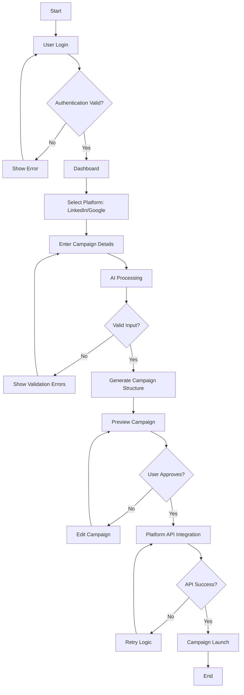
```mermaid
flowchart TD
    A[Start] --> B[User Login]
    B --> C{Authentication Valid?}
    C -->|No| D[Show Error]
    D --> B
    C -->|Yes| E[Dashboard]
    E --> F[Select Platform: LinkedIn/Google]
    F --> G[Enter Campaign Details]
    G --> H[AI Processing]
    H --> I{Valid Input?}
    I -->|No| J[Show Validation Errors]
    J --> G
    I -->|Yes| K[Generate Campaign Structure]
    K --> L[Preview Campaign]
    L --> M{User Approves?}
    M -->|No| N[Edit Campaign]
    N --> L
    M -->|Yes| O[Platform API Integration]
    O --> P{API Success?}
    P -->|No| Q[Retry Logic]
    Q --> O
    P -->|Yes| R[Campaign Launch]
    R --> S[End]
```

### Integration Workflow: Multi-Platform Synchronization

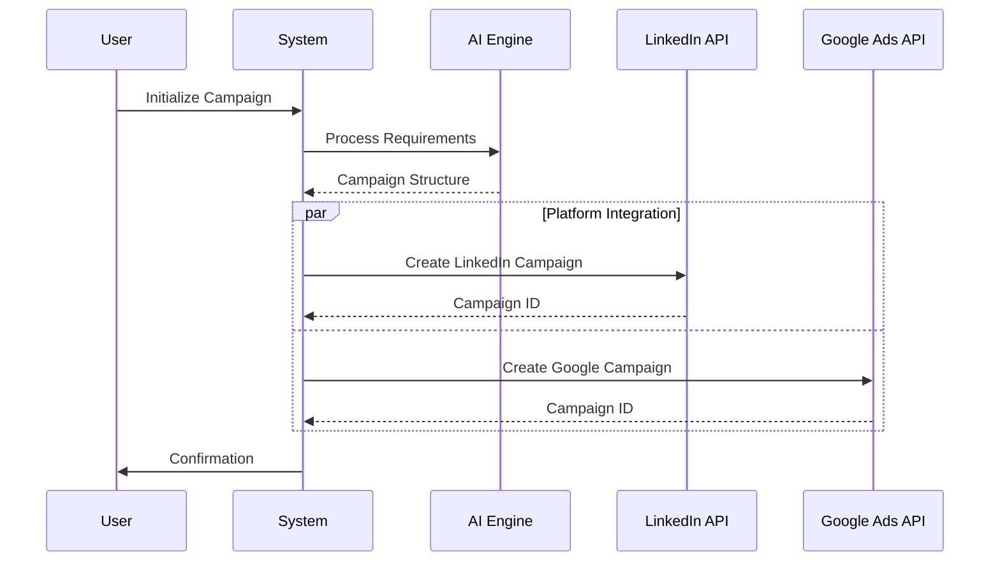
```mermaid
sequenceDiagram
    participant U as User
    participant S as System
    participant AI as AI Engine
    participant LA as LinkedIn API
    participant GA as Google Ads API
    
    U->>S: Initialize Campaign
    S->>AI: Process Requirements
    AI-->>S: Campaign Structure
    par Platform Integration
        S->>LA: Create LinkedIn Campaign
        LA-->>S: Campaign ID
    and
        S->>GA: Create Google Campaign
        GA-->>S: Campaign ID
    end
    S->>U: Confirmation
```

## 3.2. FLOWCHART REQUIREMENTS

### Campaign Optimization Flow

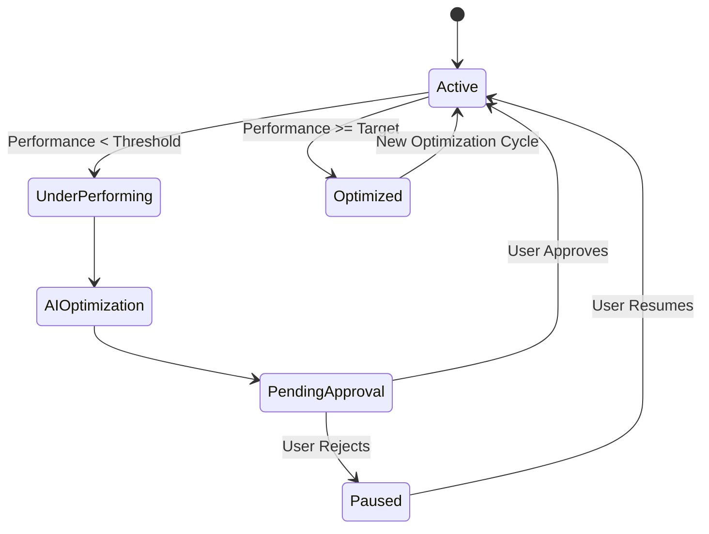
```mermaid
stateDiagram-v2
    [*] --> Active
    Active --> UnderPerforming: Performance < Threshold
    Active --> Optimized: Performance >= Target
    UnderPerforming --> AIOptimization
    AIOptimization --> PendingApproval
    PendingApproval --> Active: User Approves
    PendingApproval --> Paused: User Rejects
    Paused --> Active: User Resumes
    Optimized --> Active: New Optimization Cycle
```

### Error Handling Process

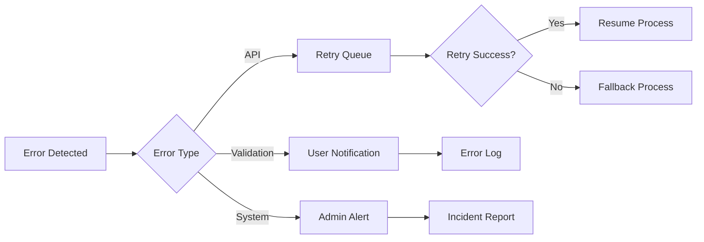
```mermaid
flowchart LR
    A[Error Detected] --> B{Error Type}
    B -->|API| C[Retry Queue]
    B -->|Validation| D[User Notification]
    B -->|System| E[Admin Alert]
    C --> F{Retry Success?}
    F -->|Yes| G[Resume Process]
    F -->|No| H[Fallback Process]
    D --> I[Error Log]
    E --> J[Incident Report]
```

## 3.3. TECHNICAL IMPLEMENTATION

### State Management Flow

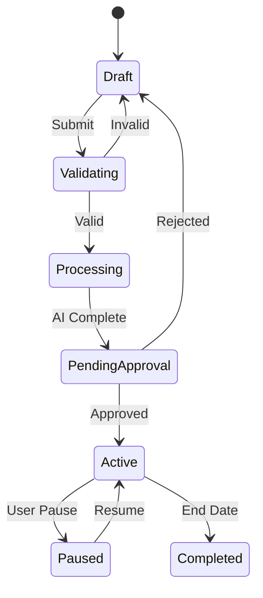
```mermaid
stateDiagram-v2
    [*] --> Draft
    Draft --> Validating: Submit
    Validating --> Processing: Valid
    Validating --> Draft: Invalid
    Processing --> PendingApproval: AI Complete
    PendingApproval --> Active: Approved
    PendingApproval --> Draft: Rejected
    Active --> Paused: User Pause
    Active --> Completed: End Date
    Paused --> Active: Resume
```

### Data Processing Pipeline

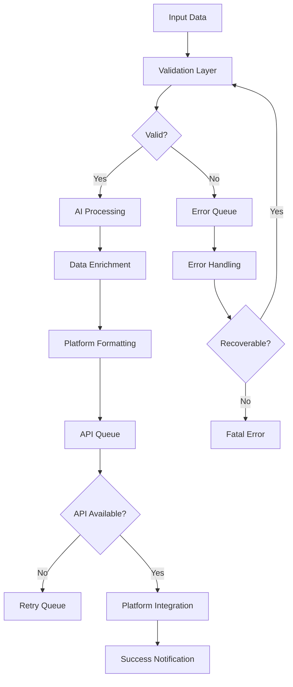
```mermaid
flowchart TD
    A[Input Data] --> B[Validation Layer]
    B --> C{Valid?}
    C -->|No| D[Error Queue]
    C -->|Yes| E[AI Processing]
    E --> F[Data Enrichment]
    F --> G[Platform Formatting]
    G --> H[API Queue]
    H --> I{API Available?}
    I -->|No| J[Retry Queue]
    I -->|Yes| K[Platform Integration]
    K --> L[Success Notification]
    D --> M[Error Handling]
    M --> N{Recoverable?}
    N -->|Yes| B
    N -->|No| O[Fatal Error]
```

## 3.4. VALIDATION AND COMPLIANCE

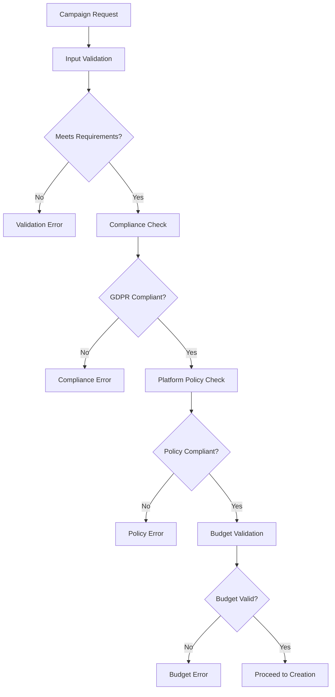
```mermaid
flowchart TD
    A[Campaign Request] --> B[Input Validation]
    B --> C{Meets Requirements?}
    C -->|No| D[Validation Error]
    C -->|Yes| E[Compliance Check]
    E --> F{GDPR Compliant?}
    F -->|No| G[Compliance Error]
    F -->|Yes| H[Platform Policy Check]
    H --> I{Policy Compliant?}
    I -->|No| J[Policy Error]
    I -->|Yes| K[Budget Validation]
    K --> L{Budget Valid?}
    L -->|No| M[Budget Error]
    L -->|Yes| N[Proceed to Creation]
```

# 4. SYSTEM ARCHITECTURE

## 4.1. HIGH-LEVEL ARCHITECTURE

### System Context (Level 0)

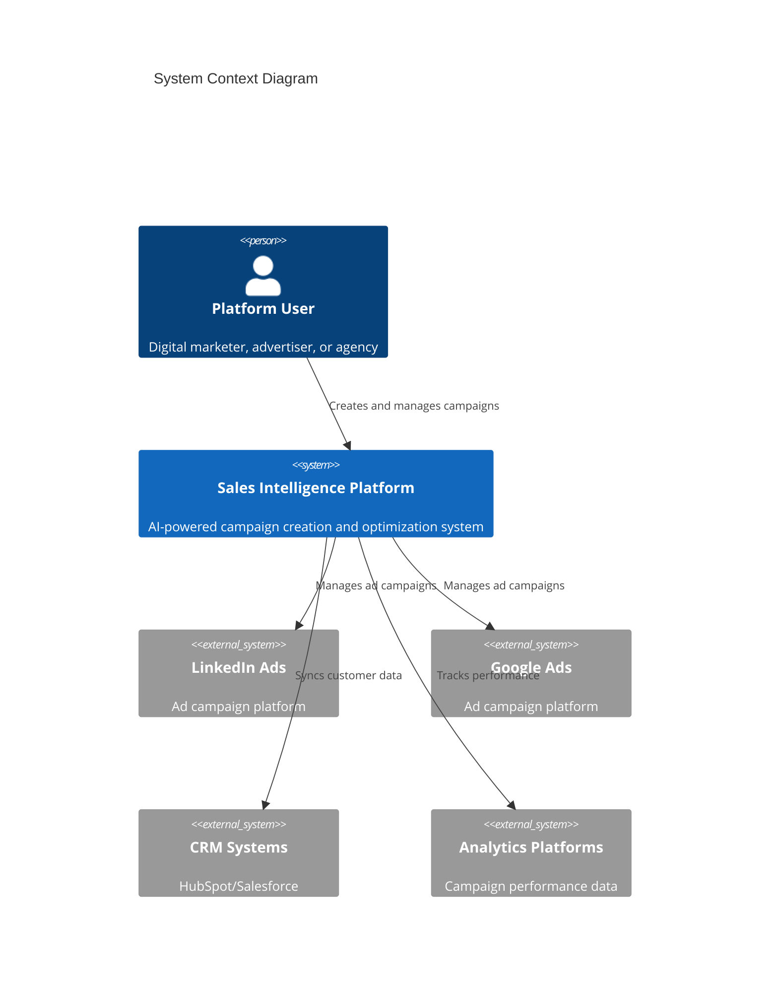
```mermaid
C4Context
    title System Context Diagram
    
    Person(user, "Platform User", "Digital marketer, advertiser, or agency")
    System(sip, "Sales Intelligence Platform", "AI-powered campaign creation and optimization system")
    
    System_Ext(linkedin, "LinkedIn Ads", "Ad campaign platform")
    System_Ext(google, "Google Ads", "Ad campaign platform")
    System_Ext(crm, "CRM Systems", "HubSpot/Salesforce")
    System_Ext(analytics, "Analytics Platforms", "Campaign performance data")
    
    Rel(user, sip, "Creates and manages campaigns")
    Rel(sip, linkedin, "Manages ad campaigns")
    Rel(sip, google, "Manages ad campaigns")
    Rel(sip, crm, "Syncs customer data")
    Rel(sip, analytics, "Tracks performance")
```

### Container Architecture (Level 1)

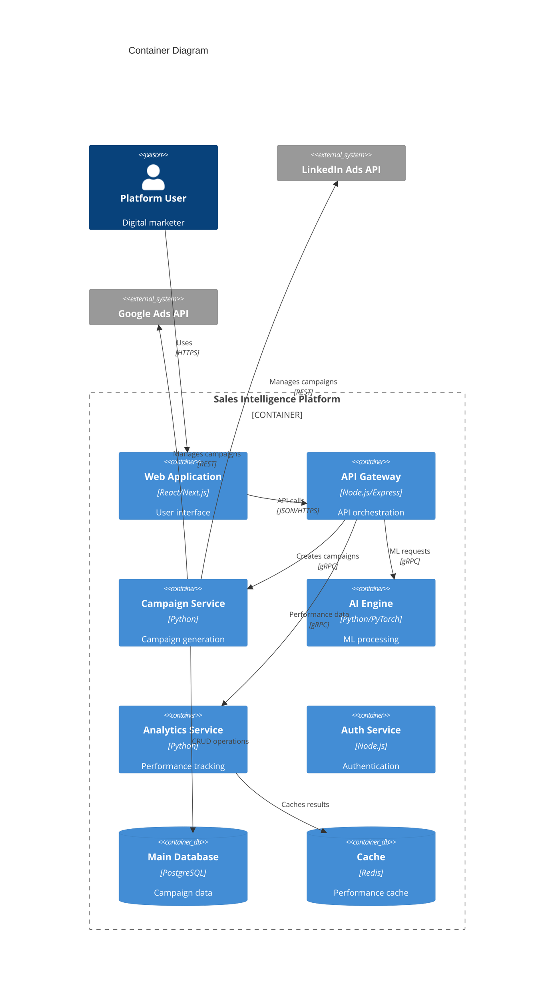
```mermaid
C4Container
    title Container Diagram
    
    Person(user, "Platform User", "Digital marketer")
    
    Container_Boundary(platform, "Sales Intelligence Platform") {
        Container(web, "Web Application", "React/Next.js", "User interface")
        Container(api, "API Gateway", "Node.js/Express", "API orchestration")
        Container(campaign, "Campaign Service", "Python", "Campaign generation")
        Container(ai, "AI Engine", "Python/PyTorch", "ML processing")
        Container(analytics, "Analytics Service", "Python", "Performance tracking")
        Container(auth, "Auth Service", "Node.js", "Authentication")
        
        ContainerDb(db, "Main Database", "PostgreSQL", "Campaign data")
        ContainerDb(cache, "Cache", "Redis", "Performance cache")
    }
    
    System_Ext(linkedin, "LinkedIn Ads API")
    System_Ext(google, "Google Ads API")
    
    Rel(user, web, "Uses", "HTTPS")
    Rel(web, api, "API calls", "JSON/HTTPS")
    Rel(api, campaign, "Creates campaigns", "gRPC")
    Rel(api, ai, "ML requests", "gRPC")
    Rel(api, analytics, "Performance data", "gRPC")
    Rel(campaign, db, "CRUD operations")
    Rel(analytics, cache, "Caches results")
    Rel(campaign, linkedin, "Manages campaigns", "REST")
    Rel(campaign, google, "Manages campaigns", "REST")
```

## 4.2. COMPONENT DETAILS

### Component Specifications

| Component | Purpose | Technology Stack | Scaling Strategy |
|-----------|---------|-----------------|------------------|
| Web Application | User interface and interaction | React, Next.js, Tailwind CSS | Horizontal scaling, CDN |
| API Gateway | Request routing and orchestration | Node.js, Express | Auto-scaling groups |
| Campaign Service | Campaign generation and management | Python, FastAPI | Kubernetes pods |
| AI Engine | ML processing and predictions | Python, PyTorch, OpenAI | GPU instances |
| Analytics Service | Performance tracking and reporting | Python, Pandas | Serverless functions |
| Auth Service | User authentication and authorization | Node.js, Firebase Auth | Load balanced |

### Data Storage Solutions

| Store Type | Technology | Purpose | Scaling Approach |
|------------|------------|---------|------------------|
| Primary Database | PostgreSQL | Campaign and user data | Master-slave replication |
| Cache Layer | Redis | Performance data, sessions | Cluster mode |
| Document Store | MongoDB | Unstructured campaign data | Sharding |
| Queue System | RabbitMQ | Async processing | Clustered deployment |

## 4.3. TECHNICAL DECISIONS

### Architecture Patterns

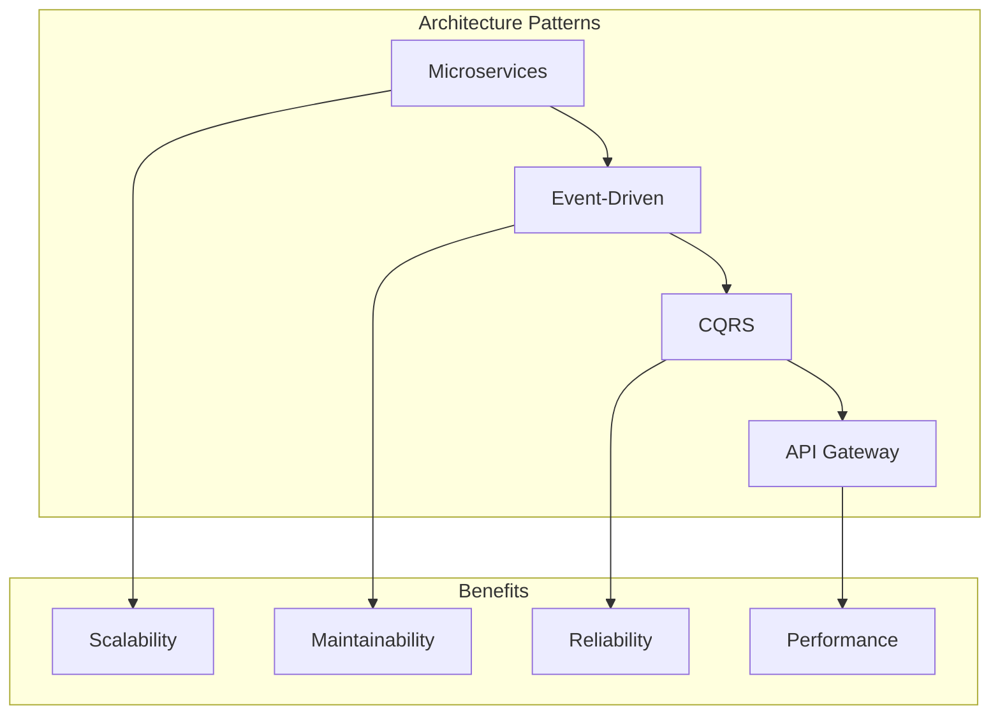
```mermaid
flowchart TD
    subgraph "Architecture Patterns"
        A[Microservices] --> B[Event-Driven]
        B --> C[CQRS]
        C --> D[API Gateway]
    end
    
    subgraph "Benefits"
        E[Scalability]
        F[Maintainability]
        G[Reliability]
        H[Performance]
    end
    
    A --> E
    B --> F
    C --> G
    D --> H
```

## 4.4. CROSS-CUTTING CONCERNS

### Monitoring and Observability

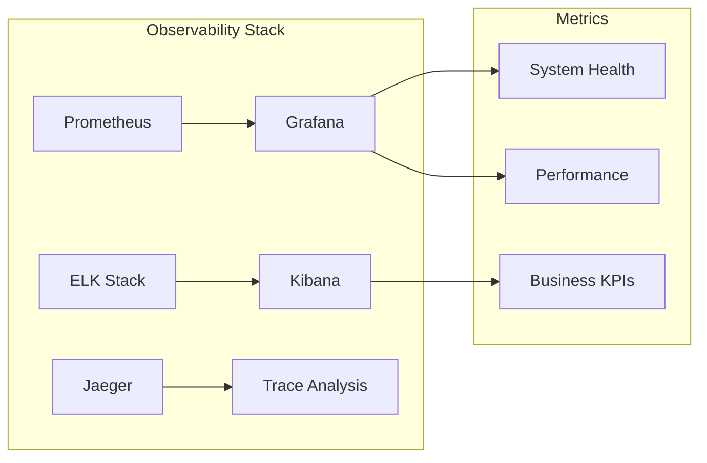
```mermaid
flowchart LR
    subgraph "Observability Stack"
        A[Prometheus] --> B[Grafana]
        C[ELK Stack] --> D[Kibana]
        E[Jaeger] --> F[Trace Analysis]
    end
    
    subgraph "Metrics"
        G[System Health]
        H[Performance]
        I[Business KPIs]
    end
    
    B --> G
    B --> H
    D --> I
```

### Deployment Architecture

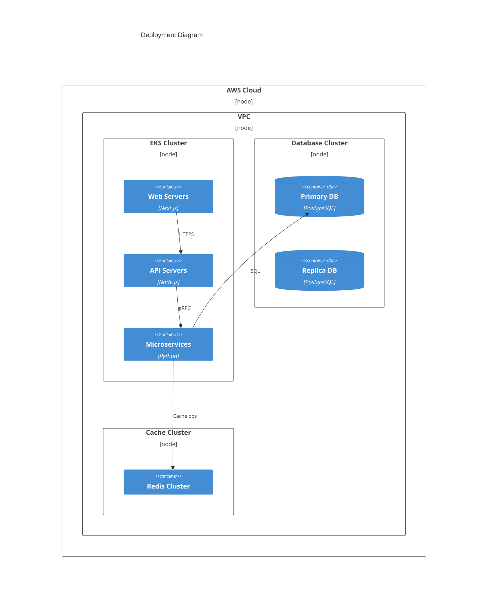
```mermaid
C4Deployment
    title Deployment Diagram
    
    Deployment_Node(aws, "AWS Cloud") {
        Deployment_Node(vpc, "VPC") {
            Deployment_Node(eks, "EKS Cluster") {
                Container(web, "Web Servers", "Next.js")
                Container(api, "API Servers", "Node.js")
                Container(services, "Microservices", "Python")
            }
            
            Deployment_Node(db, "Database Cluster") {
                ContainerDb(primary, "Primary DB", "PostgreSQL")
                ContainerDb(replica, "Replica DB", "PostgreSQL")
            }
            
            Deployment_Node(cache, "Cache Cluster") {
                Container(redis, "Redis Cluster")
            }
        }
    }
    
    Rel(web, api, "HTTPS")
    Rel(api, services, "gRPC")
    Rel(services, primary, "SQL")
    Rel(services, redis, "Cache ops")
```

## 4.5. DATA FLOW ARCHITECTURE

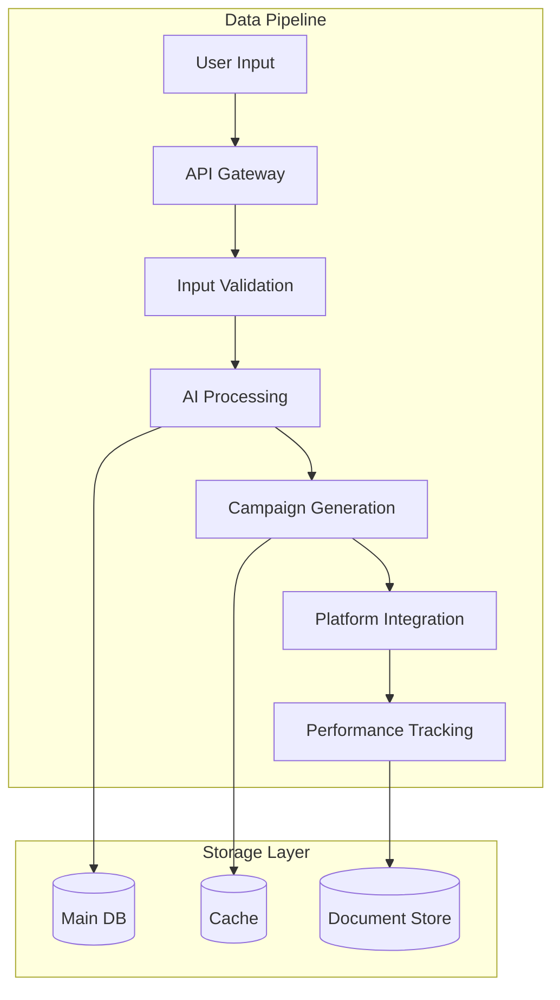
```mermaid
flowchart TD
    subgraph "Data Pipeline"
        A[User Input] --> B[API Gateway]
        B --> C[Input Validation]
        C --> D[AI Processing]
        D --> E[Campaign Generation]
        E --> F[Platform Integration]
        F --> G[Performance Tracking]
    end
    
    subgraph "Storage Layer"
        H[(Main DB)]
        I[(Cache)]
        J[(Document Store)]
    end
    
    D --> H
    E --> I
    G --> J
```

# 5. SYSTEM COMPONENTS DESIGN

## 5.1. CORE SERVICES ARCHITECTURE

### Service Components

| Service | Responsibility | Communication Pattern | Discovery Method |
|---------|---------------|----------------------|------------------|
| Campaign Service | Campaign generation and management | REST/gRPC | Kubernetes Service |
| AI Engine | ML processing and predictions | gRPC | Service Mesh |
| Analytics Service | Performance tracking | REST/WebSocket | DNS-based |
| Auth Service | User authentication | REST | Load Balancer |
| Integration Service | Platform connectivity | REST/Webhook | API Gateway |

#### Load Balancing Strategy

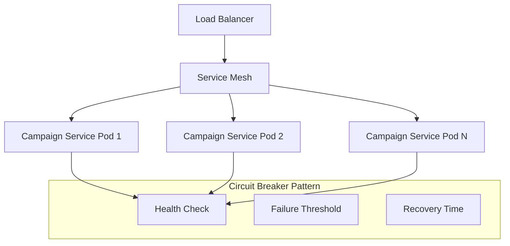
```mermaid
flowchart TD
    A[Load Balancer] --> B[Service Mesh]
    B --> C1[Campaign Service Pod 1]
    B --> C2[Campaign Service Pod 2]
    B --> C3[Campaign Service Pod N]
    
    subgraph "Circuit Breaker Pattern"
        D[Health Check]
        E[Failure Threshold]
        F[Recovery Time]
    end
    
    C1 --> D
    C2 --> D
    C3 --> D
```

### Scalability Design

| Component | Scaling Approach | Triggers | Resource Allocation |
|-----------|-----------------|----------|-------------------|
| Campaign Service | Horizontal | CPU > 70%, Memory > 80% | 2-8 pods |
| AI Engine | Vertical + GPU | Queue Length > 100 | GPU instances |
| Analytics Service | Horizontal | Request Rate > 1000/s | 3-12 pods |
| Auth Service | Horizontal | Active Sessions > 5000 | 2-6 pods |

### Resilience Patterns

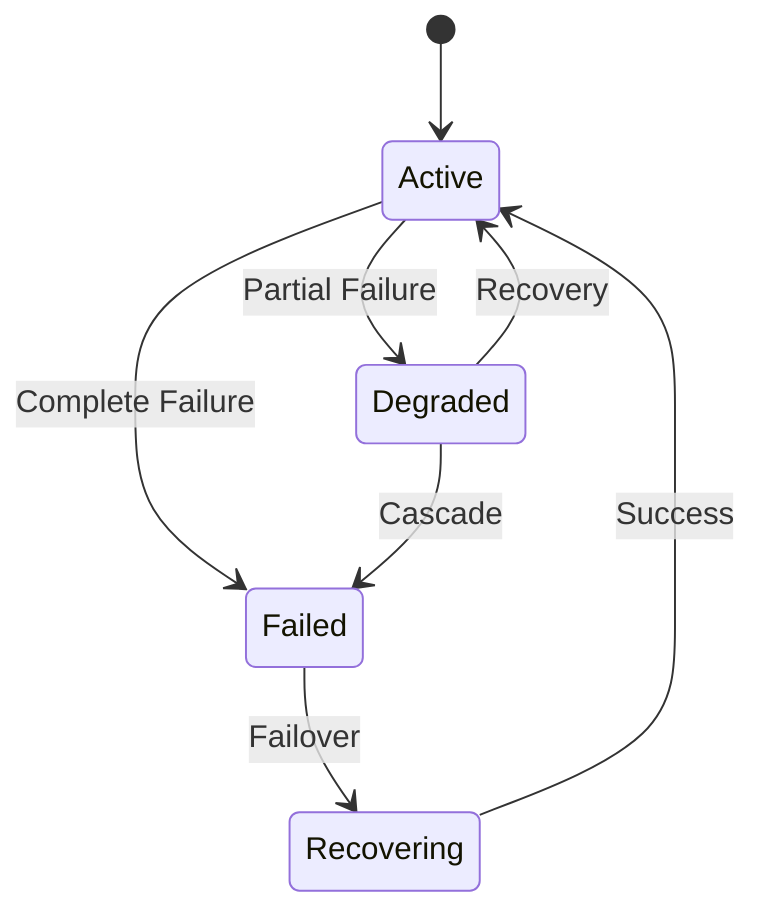
```mermaid
stateDiagram-v2
    [*] --> Active
    Active --> Degraded: Partial Failure
    Active --> Failed: Complete Failure
    Degraded --> Active: Recovery
    Degraded --> Failed: Cascade
    Failed --> Recovering: Failover
    Recovering --> Active: Success
```

## 5.2. DATABASE DESIGN

### Schema Design

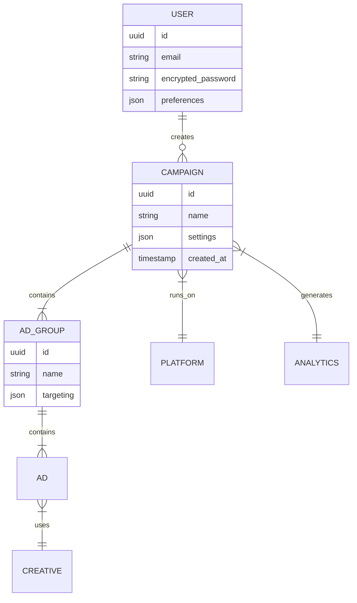
```mermaid
erDiagram
    USER ||--o{ CAMPAIGN : creates
    CAMPAIGN ||--|{ AD_GROUP : contains
    AD_GROUP ||--|{ AD : contains
    CAMPAIGN }|--|| PLATFORM : runs_on
    AD }|--|| CREATIVE : uses
    CAMPAIGN }|--|| ANALYTICS : generates

    USER {
        uuid id
        string email
        string encrypted_password
        json preferences
    }
    CAMPAIGN {
        uuid id
        string name
        json settings
        timestamp created_at
    }
    AD_GROUP {
        uuid id
        string name
        json targeting
    }
```

#### Indexing Strategy

| Table | Index Type | Columns | Purpose |
|-------|------------|---------|---------|
| campaigns | B-tree | (user_id, created_at) | Fast user queries |
| analytics | Hash | campaign_id | Performance lookup |
| ad_groups | B-tree | (campaign_id, status) | Campaign management |

### Data Management

| Aspect | Strategy | Implementation |
|--------|----------|----------------|
| Versioning | Schema versioning | Flyway migrations |
| Archival | Time-based partitioning | Monthly archives |
| Retention | Compliance-based | 24-month active data |
| Privacy | Column-level encryption | AES-256 |

## 5.3. INTEGRATION ARCHITECTURE

### API Design

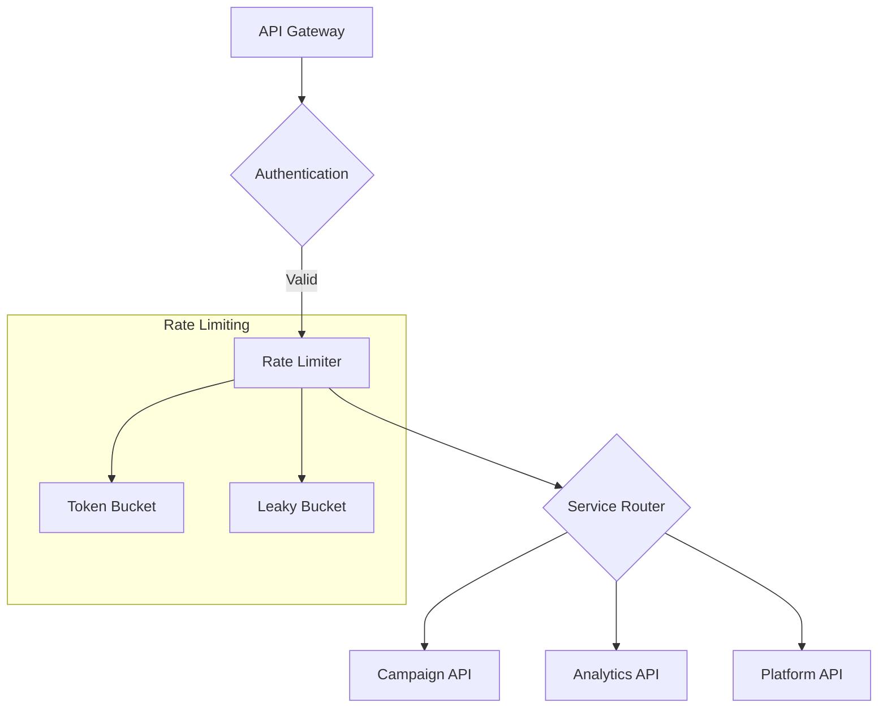
```mermaid
flowchart TD
    A[API Gateway] --> B{Authentication}
    B -->|Valid| C[Rate Limiter]
    C --> D{Service Router}
    D --> E[Campaign API]
    D --> F[Analytics API]
    D --> G[Platform API]
    
    subgraph "Rate Limiting"
        C --> H[Token Bucket]
        C --> I[Leaky Bucket]
    end
```

### Message Processing

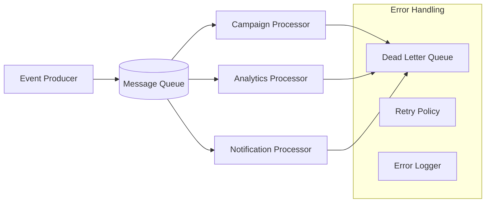
```mermaid
flowchart LR
    A[Event Producer] --> B[(Message Queue)]
    B --> C[Campaign Processor]
    B --> D[Analytics Processor]
    B --> E[Notification Processor]
    
    subgraph "Error Handling"
        F[Dead Letter Queue]
        G[Retry Policy]
        H[Error Logger]
    end
    
    C --> F
    D --> F
    E --> F
```

## 5.4. SECURITY ARCHITECTURE

### Authentication Framework

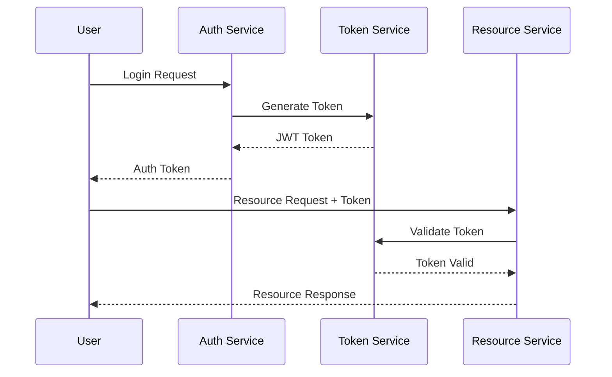
```mermaid
sequenceDiagram
    participant U as User
    participant A as Auth Service
    participant T as Token Service
    participant R as Resource Service
    
    U->>A: Login Request
    A->>T: Generate Token
    T-->>A: JWT Token
    A-->>U: Auth Token
    U->>R: Resource Request + Token
    R->>T: Validate Token
    T-->>R: Token Valid
    R-->>U: Resource Response
```

### Authorization System

| Role | Permissions | Resource Access |
|------|------------|-----------------|
| Admin | Full access | All resources |
| Manager | Campaign management | Own campaigns |
| Analyst | Read-only | Analytics data |
| API User | Limited access | API endpoints |

### Data Protection

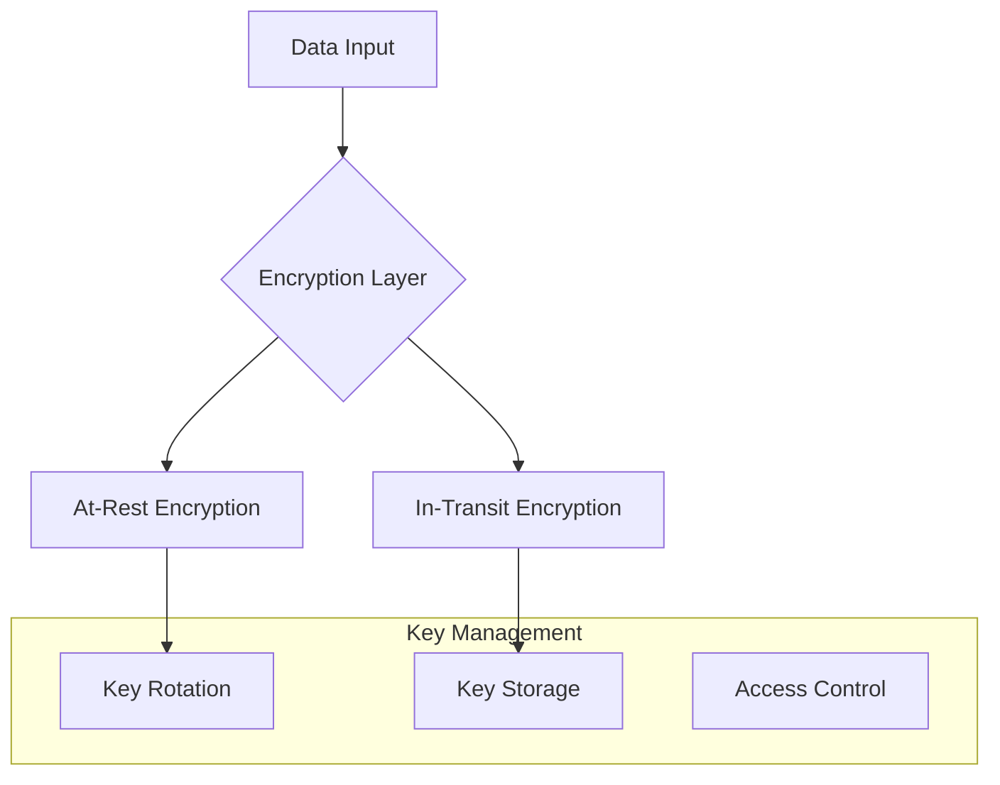
```mermaid
flowchart TD
    A[Data Input] --> B{Encryption Layer}
    B --> C[At-Rest Encryption]
    B --> D[In-Transit Encryption]
    
    subgraph "Key Management"
        E[Key Rotation]
        F[Key Storage]
        G[Access Control]
    end
    
    C --> E
    D --> F
```

# 6. TECHNOLOGY STACK

## 6.1. PROGRAMMING LANGUAGES

| Layer | Language | Version | Justification |
|-------|----------|---------|---------------|
| Frontend | TypeScript | 5.0+ | Type safety, better IDE support for complex campaign structures |
| Backend API | Node.js | 18 LTS | High performance for API gateway, excellent ecosystem |
| AI Services | Python | 3.11+ | Superior ML libraries, OpenAI/PyTorch integration |
| Infrastructure | Go | 1.20+ | Efficient microservices, high concurrency for analytics |

## 6.2. FRAMEWORKS & LIBRARIES

### Frontend Stack

| Component | Technology | Version | Purpose |
|-----------|------------|---------|----------|
| UI Framework | Next.js | 14.0+ | Server-side rendering, optimized performance |
| State Management | Redux Toolkit | 2.0+ | Complex campaign state handling |
| UI Components | Tailwind CSS | 3.0+ | Rapid UI development, consistent styling |
| Data Visualization | D3.js | 7.0+ | Complex campaign analytics visualization |

### Backend Stack

| Component | Technology | Version | Purpose |
|-----------|------------|---------|----------|
| API Framework | Express.js | 4.18+ | RESTful API endpoints, middleware support |
| ML Framework | PyTorch | 2.0+ | Custom ML models for campaign optimization |
| API Documentation | OpenAPI | 3.1 | API specification and documentation |
| GraphQL | Apollo Server | 4.0+ | Efficient data querying for dashboards |

## 6.3. DATABASES & STORAGE

```mermaid
flowchart TD
    A[Application Layer] --> B[Data Access Layer]
    B --> C[(PostgreSQL)]
    B --> D[(MongoDB)]
    B --> E[(Redis)]
    
    subgraph "Data Storage"
        C --> F[Campaign Data]
        D --> G[Analytics Data]
        E --> H[Cache Layer]
    end
```

### Storage Solutions

| Type | Technology | Purpose | Scaling Strategy |
|------|------------|---------|------------------|
| Primary DB | PostgreSQL 15+ | Campaign and user data | Horizontal sharding |
| Document Store | MongoDB 6.0+ | Analytics and unstructured data | Replica sets |
| Cache | Redis 7.0+ | Session and performance data | Cluster mode |
| Object Storage | S3 | Creative assets and exports | CDN distribution |

## 6.4. THIRD-PARTY SERVICES

### API Integrations

| Service | Purpose | Integration Method |
|---------|---------|-------------------|
| LinkedIn Ads API | Campaign management | REST API |
| Google Ads API | Campaign management | gRPC |
| OpenAI API | Ad copy generation | REST API |
| HubSpot/Salesforce | CRM integration | REST API/Webhooks |

### Cloud Services

```mermaid
flowchart LR
    A[AWS Services] --> B[EKS]
    A --> C[RDS]
    A --> D[ElastiCache]
    A --> E[S3]
    
    subgraph "Monitoring"
        F[CloudWatch]
        G[Prometheus]
        H[Grafana]
    end
    
    B --> F
    B --> G
    G --> H
```

## 6.5. DEVELOPMENT & DEPLOYMENT

### Development Environment

| Tool | Purpose | Version |
|------|---------|---------|
| Docker | Containerization | 24.0+ |
| Kubernetes | Container orchestration | 1.27+ |
| Terraform | Infrastructure as code | 1.5+ |
| GitHub Actions | CI/CD pipeline | Latest |

### Deployment Pipeline

```mermaid
flowchart TD
    A[Code Push] --> B[CI Pipeline]
    B --> C{Tests Pass?}
    C -->|Yes| D[Build Images]
    C -->|No| E[Fail Build]
    D --> F[Deploy to Staging]
    F --> G{Stage Tests Pass?}
    G -->|Yes| H[Deploy to Production]
    G -->|No| I[Rollback]
    
    subgraph "Monitoring"
        J[Health Checks]
        K[Performance Metrics]
        L[Error Tracking]
    end
    
    H --> J
    H --> K
    H --> L
```

### Build System

| Stage | Tool | Configuration |
|-------|------|---------------|
| Build | Webpack 5 | Production optimization |
| Testing | Jest/Cypress | E2E and unit testing |
| Linting | ESLint/Prettier | Code quality enforcement |
| Monitoring | Datadog | Application performance |

# 7. USER INTERFACE DESIGN

## 7.1. WIREFRAME KEY

```
NAVIGATION & ACTIONS          DATA ENTRY              STATUS & ALERTS
[#] Dashboard/Menu           [...] Text Input         [!] Warning/Error
[@] User Profile            [ ] Checkbox             [i] Information
[=] Settings               ( ) Radio Button          [*] Important
[<] [>] Navigation         [v] Dropdown              [$] Payment/Budget
[+] Create/Add             [^] File Upload           [?] Help/Info
[x] Close/Delete           [====] Progress Bar       [OK] Success
```

## 7.2. MAIN DASHBOARD

```
+----------------------------------------------------------+
|  [#] Sales Intelligence Platform             [@] [?] [=]   |
+----------------------------------------------------------+
|                                                           |
|  Welcome back, {User Name}                                |
|  [!] 3 campaigns need optimization                        |
|                                                           |
|  +-------------------+  +--------------------+            |
|  | Active Campaigns  |  | Performance        |            |
|  | [$] Budget: $5K   |  | [====] 78% CTR     |            |
|  | [*] Priority: 3   |  | [====] 65% Conv    |            |
|  +-------------------+  +--------------------+            |
|                                                           |
|  [+] New Campaign    [i] Analytics    [?] Support        |
|                                                           |
+----------------------------------------------------------+
```

## 7.3. CAMPAIGN CREATION WIZARD

```
+----------------------------------------------------------+
|  Create New Campaign                         [?] [x]       |
+----------------------------------------------------------+
|  Step 1 of 4: Platform & Objectives                       |
|  [====================================]                   |
|                                                           |
|  Select Platform:                                         |
|  ( ) LinkedIn Ads                                         |
|  ( ) Google Ads                                          |
|                                                           |
|  Campaign Objective:                                      |
|  [v] Lead Generation                                      |
|                                                           |
|  Budget Range:                                            |
|  [$] [...................] Daily Budget                   |
|                                                           |
|  [< Back]                              [Next >]           |
+----------------------------------------------------------+
```

## 7.4. AUDIENCE TARGETING INTERFACE

```
+----------------------------------------------------------+
|  Campaign: {Campaign Name}                    [?] [x]      |
+----------------------------------------------------------+
|                                                           |
|  Target Audience Builder                                  |
|  +------------------------+  +------------------------+    |
|  | Demographics          |  | AI Recommendations     |    |
|  | [v] Industry         |  | [*] Similar audience 1  |    |
|  | [v] Company Size     |  | [*] Similar audience 2  |    |
|  | [...] Location       |  | [+] Add Recommendation |    |
|  +------------------------+  +------------------------+    |
|                                                           |
|  Audience Reach:                                         |
|  [=========] 500K potential viewers                      |
|                                                           |
|  [Save Draft]                           [Continue >]      |
+----------------------------------------------------------+
```

## 7.5. ANALYTICS DASHBOARD

```
+----------------------------------------------------------+
|  Campaign Analytics                         [@] [^] [=]    |
+----------------------------------------------------------+
|  Date Range: [v] Last 30 Days                             |
|                                                           |
|  +-------------------+  +--------------------+            |
|  | Key Metrics       |  | Trend Analysis     |            |
|  | CTR: 2.4%        |  |      ^             |            |
|  | CPC: $3.21       |  |    /               |            |
|  | Conv: 156        |  |  /                 |            |
|  +-------------------+  +--------------------+            |
|                                                           |
|  [!] AI Optimization Suggestions:                         |
|  [ ] Increase bid by 10%                                  |
|  [ ] Adjust audience targeting                            |
|  [ ] Update ad copy                                       |
|                                                           |
|  [Apply Selected]                    [Export Report]      |
+----------------------------------------------------------+
```

## 7.6. CREATIVE MANAGEMENT

```
+----------------------------------------------------------+
|  Ad Creative Manager                        [+] [?]        |
+----------------------------------------------------------+
|                                                           |
|  Active Creatives:                                        |
|  +----------------+  +----------------+  +----------------+|
|  | Creative 1     |  | Creative 2     |  | Creative 3     ||
|  | [i] Active    |  | [!] Review     |  | [*] Best Perf  ||
|  | [x] Delete    |  | [x] Delete     |  | [x] Delete     ||
|  +----------------+  +----------------+  +----------------+|
|                                                           |
|  AI Suggestions:                                          |
|  [v] Generate new ad copy                                 |
|  [v] Optimize headlines                                   |
|  [^] Upload custom creative                               |
|                                                           |
|  [Generate New]                        [Save Changes]     |
+----------------------------------------------------------+
```

## 7.7. RESPONSIVE DESIGN SPECIFICATIONS

| Breakpoint | Layout Changes | Navigation |
|------------|----------------|------------|
| Desktop (>1200px) | Full sidebar, expanded metrics | Horizontal menu |
| Tablet (768-1199px) | Collapsed sidebar, grid layout | Hamburger menu |
| Mobile (<767px) | Single column, stacked components | Bottom navigation |

## 7.8. INTERACTION PATTERNS

| Element | Action | Response |
|---------|---------|-----------|
| Campaign Cards | Click | Expands to show details |
| Metrics | Hover | Shows tooltip with details |
| AI Suggestions | Toggle | Updates preview in real-time |
| Navigation | Swipe | Moves between sections (mobile) |
| Charts | Click | Drills down to detailed view |

# 8. INFRASTRUCTURE

## 8.1. DEPLOYMENT ENVIRONMENT

### Environment Strategy

| Environment | Purpose | Infrastructure | Scaling Strategy |
|-------------|---------|----------------|------------------|
| Development | Feature development, testing | AWS EKS (Single cluster) | Manual scaling |
| Staging | Integration testing, UAT | AWS EKS (Multi-zone) | Auto-scaling (1-3 nodes) |
| Production | Live system | AWS EKS (Multi-region) | Auto-scaling (3-10 nodes) |

### Regional Distribution

```mermaid
flowchart TD
    A[Global Load Balancer] --> B[US-East]
    A --> C[EU-West]
    A --> D[APAC]
    
    subgraph "US-East"
        B --> B1[EKS Cluster]
        B1 --> B2[RDS Multi-AZ]
        B1 --> B3[ElastiCache]
    end
    
    subgraph "EU-West"
        C --> C1[EKS Cluster]
        C1 --> C2[RDS Multi-AZ]
        C1 --> C3[ElastiCache]
    end
    
    subgraph "APAC"
        D --> D1[EKS Cluster]
        D1 --> D2[RDS Multi-AZ]
        D1 --> D3[ElastiCache]
    end
```

## 8.2. CLOUD SERVICES

### AWS Service Architecture

| Service Category | AWS Service | Purpose | Configuration |
|-----------------|-------------|----------|---------------|
| Compute | EKS | Container orchestration | 1.27+, managed node groups |
| Database | RDS PostgreSQL | Primary data store | Multi-AZ, 15.x |
| Caching | ElastiCache | Session and performance data | Redis 7.0, cluster mode |
| Storage | S3 | Asset storage, backups | Standard + Glacier |
| CDN | CloudFront | Static content delivery | Global edge locations |
| Security | WAF, Shield | DDoS protection | Enterprise plan |
| Monitoring | CloudWatch | System monitoring | Custom metrics enabled |

### Service Dependencies

```mermaid
flowchart LR
    A[Route 53] --> B[CloudFront]
    B --> C[ALB]
    C --> D[EKS Cluster]
    D --> E[RDS]
    D --> F[ElastiCache]
    D --> G[S3]
    
    subgraph "Security"
        H[WAF]
        I[Shield]
        J[ACM]
    end
    
    B --> H
    H --> I
    B --> J
```

## 8.3. CONTAINERIZATION

### Docker Configuration

| Component | Base Image | Size | Build Strategy |
|-----------|------------|------|----------------|
| Frontend | node:18-alpine | ~200MB | Multi-stage build |
| Backend API | node:18-alpine | ~250MB | Multi-stage build |
| AI Services | python:3.11-slim | ~1.2GB | Multi-stage build |
| Analytics | python:3.11-slim | ~800MB | Multi-stage build |

### Container Architecture

```mermaid
flowchart TD
    A[Ingress Controller] --> B[Frontend Service]
    A --> C[Backend API Service]
    A --> D[AI Service]
    
    subgraph "Data Layer"
        E[(PostgreSQL)]
        F[(Redis)]
    end
    
    B --> C
    C --> D
    C --> E
    C --> F
```

## 8.4. ORCHESTRATION

### Kubernetes Configuration

| Resource Type | Purpose | Scaling Policy |
|--------------|---------|----------------|
| Deployments | Application workloads | HPA based on CPU/Memory |
| StatefulSets | Databases, message queues | Manual scaling |
| DaemonSets | Monitoring, logging | One per node |
| ConfigMaps | Configuration | Environment-specific |
| Secrets | Sensitive data | AWS Secrets Manager integration |

### Cluster Architecture

```mermaid
flowchart TD
    A[AWS Load Balancer Controller] --> B[Ingress]
    B --> C[Services]
    C --> D[Pods]
    
    subgraph "Node Groups"
        E[General Purpose]
        F[CPU Optimized]
        G[Memory Optimized]
    end
    
    D --> E
    D --> F
    D --> G
```

## 8.5. CI/CD PIPELINE

### Pipeline Stages

```mermaid
flowchart LR
    A[Code Push] --> B[Build]
    B --> C[Test]
    C --> D[Security Scan]
    D --> E[Deploy to Staging]
    E --> F[Integration Tests]
    F --> G[Deploy to Production]
    
    subgraph "Quality Gates"
        H[Code Coverage]
        I[Security Rules]
        J[Performance Tests]
    end
    
    C --> H
    D --> I
    F --> J
```

### Deployment Strategy

| Stage | Tool | Strategy | Rollback Plan |
|-------|------|----------|---------------|
| Build | GitHub Actions | Multi-stage Docker builds | Cache invalidation |
| Test | Jest, Cypress | Parallel test execution | Fail fast |
| Security | Snyk, SonarQube | Block on high severity | Auto-remediation |
| Deployment | ArgoCD | Blue/Green deployment | Automatic rollback |
| Monitoring | Datadog | Real-time metrics | Alert-based rollback |

### Release Management

```mermaid
stateDiagram-v2
    [*] --> Build
    Build --> Test
    Test --> SecurityScan
    SecurityScan --> StagingDeploy
    StagingDeploy --> IntegrationTests
    IntegrationTests --> ProductionDeploy
    ProductionDeploy --> HealthCheck
    HealthCheck --> [*]: Success
    HealthCheck --> Rollback: Failure
    Rollback --> [*]
```

# APPENDICES

## A.1. ADDITIONAL TECHNICAL INFORMATION

### A.1.1. AI Model Specifications

| Model Type | Purpose | Framework | Training Data Requirements |
|------------|---------|-----------|---------------------------|
| GPT-based Copy Generator | Ad copy creation | OpenAI API | Historical ad performance data |
| BERT Classification | Audience segmentation | PyTorch | User behavior patterns |
| Custom ML Models | Performance prediction | TensorFlow | Campaign metrics, conversions |

### A.1.2. Performance Metrics

```mermaid
flowchart TD
    A[Campaign Performance] --> B[Engagement Metrics]
    A --> C[Conversion Metrics]
    A --> D[Cost Metrics]
    
    B --> B1[CTR]
    B --> B2[Impressions]
    B --> B3[Interaction Rate]
    
    C --> C1[Conversion Rate]
    C --> C2[Lead Quality]
    C --> C3[ROI]
    
    D --> D1[CPC]
    D --> D2[CPM]
    D --> D3[ROAS]
```

## A.2. GLOSSARY

| Term | Definition |
|------|------------|
| Campaign Structure | Hierarchical organization of ad groups, targeting parameters, and creative assets |
| Audience Segmentation | Process of dividing target audience into distinct groups based on characteristics |
| Creative Recommendations | AI-generated suggestions for ad visuals and copy based on performance data |
| Performance Optimization | Automated process of improving campaign metrics through AI-driven adjustments |
| Lookalike Audience | Target audience segment sharing characteristics with existing high-value customers |
| Multi-Platform Support | Capability to manage campaigns across different advertising platforms |
| Ready-to-Use Campaign | Pre-configured campaign structure that requires minimal manual adjustment |

## A.3. ACRONYMS

| Acronym | Full Form |
|---------|-----------|
| AI | Artificial Intelligence |
| ML | Machine Learning |
| API | Application Programming Interface |
| CTR | Click-Through Rate |
| CPC | Cost Per Click |
| CPM | Cost Per Mille (Cost per thousand impressions) |
| ROAS | Return On Ad Spend |
| ROI | Return On Investment |
| BERT | Bidirectional Encoder Representations from Transformers |
| GPT | Generative Pre-trained Transformer |
| CRM | Customer Relationship Management |
| GDPR | General Data Protection Regulation |
| UI | User Interface |
| UAT | User Acceptance Testing |
| MVP | Minimum Viable Product |
| SaaS | Software as a Service |
| REST | Representational State Transfer |
| OAuth | Open Authorization |
| AWS | Amazon Web Services |
| CDN | Content Delivery Network |

## A.4. INTEGRATION SPECIFICATIONS

```mermaid
flowchart LR
    A[Platform Core] --> B{API Gateway}
    B --> C[LinkedIn Ads API]
    B --> D[Google Ads API]
    B --> E[CRM Systems]
    
    subgraph "Authentication"
        F[OAuth 2.0]
        G[API Keys]
        H[JWT Tokens]
    end
    
    subgraph "Data Flow"
        I[Campaign Data]
        J[Analytics Data]
        K[User Data]
    end
    
    C --> I
    D --> I
    E --> K
    I --> J
```

## A.5. COMPLIANCE REQUIREMENTS

| Requirement Type | Description | Implementation |
|-----------------|-------------|----------------|
| Data Privacy | GDPR compliance | Data encryption, user consent management |
| Platform Policies | LinkedIn & Google Ads compliance | Automated policy checking |
| Security Standards | SOC 2 compliance | Regular security audits |
| Data Retention | Industry standards | Automated data lifecycle management |
| Authentication | OAuth 2.0 standards | Secure token management |