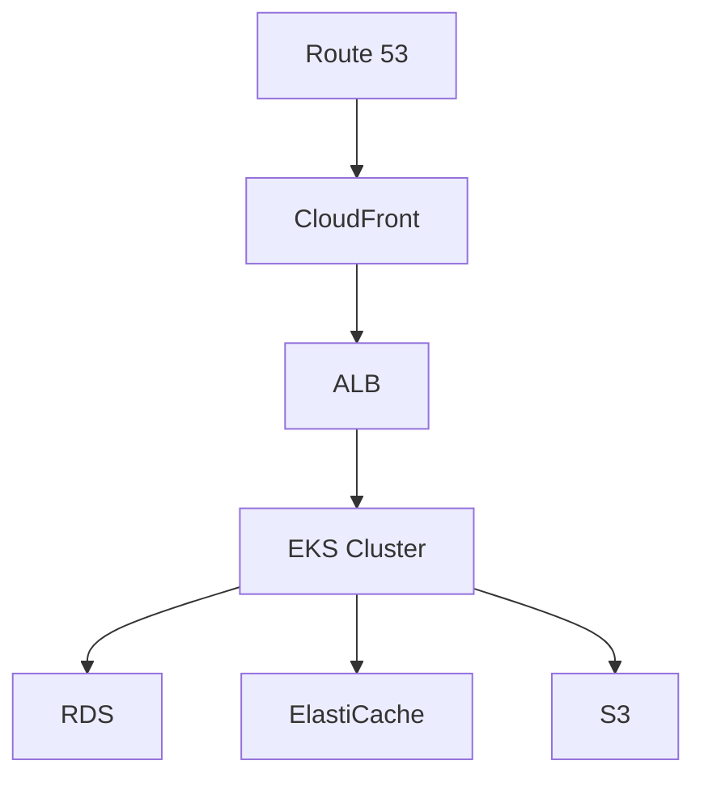

# Sales Intelligence Platform Infrastructure

## Table of Contents
- [Prerequisites](#prerequisites)
- [Infrastructure Overview](#infrastructure-overview)
- [Getting Started](#getting-started)
- [Environment Setup](#environment-setup)
- [Security and Compliance](#security-and-compliance)
- [Monitoring and Observability](#monitoring-and-observability)
- [Disaster Recovery](#disaster-recovery)
- [Performance Optimization](#performance-optimization)

## Prerequisites

### Required Tools and Versions
- Terraform v1.5.0+
- AWS CLI v2.0+
- kubectl v1.27+
- Docker v24.0+
- Helm v3.0+

### AWS Account Setup
1. Create an AWS account with administrative access
2. Configure IAM roles and policies:
   ```bash
   aws configure
   ```

### Access Credentials
- AWS access keys with necessary permissions
- EKS cluster access credentials
- Docker registry credentials
- Monitoring system credentials

## Infrastructure Overview

### Core Components
- **VPC and Networking**: Multi-AZ setup with public/private subnets
- **EKS Cluster**: v1.27+ with node groups for different workloads
- **RDS**: PostgreSQL 15.4 with Multi-AZ deployment
- **ElastiCache**: Redis 7.0 cluster for caching
- **S3**: Asset storage and backup management

### High-Level Architecture


## Getting Started

### Initial Setup
1. Clone the repository:
   ```bash
   git clone <repository_url>
   cd infrastructure
   ```

2. Initialize Terraform:
   ```bash
   terraform init -backend-config=config/backend-${ENV}.hcl
   ```

3. Deploy infrastructure:
   ```bash
   terraform plan -var-file=config/${ENV}.tfvars
   terraform apply -var-file=config/${ENV}.tfvars
   ```

### Environment Configuration
```hcl
# config/prod.tfvars
environment         = "prod"
aws_region         = "us-east-1"
vpc_cidr           = "10.0.0.0/16"
availability_zones = ["a", "b", "c"]

eks_node_groups = {
  general = {
    instance_types = ["t3.large"]
    scaling_config = {
      desired_size = 3
      max_size     = 10
      min_size     = 1
    }
  }
  cpu_optimized = {
    instance_types = ["c6i.xlarge"]
    scaling_config = {
      desired_size = 2
      max_size     = 8
      min_size     = 1
    }
  }
}
```

## Security and Compliance

### Network Security
- VPC with private subnets for workloads
- Security groups with least privilege access
- Network ACLs for subnet-level security

### Data Protection
- At-rest encryption using KMS
- In-transit encryption using TLS
- Secrets management using AWS Secrets Manager

### Access Control
- IAM roles with least privilege
- RBAC for Kubernetes resources
- Multi-factor authentication for critical operations

## Monitoring and Observability

### Monitoring Stack
- Prometheus for metrics collection
- Grafana for visualization
- ELK Stack for log aggregation
- Jaeger for distributed tracing

### Alert Configuration
```yaml
# prometheus/rules/service_alerts.rules
groups:
  - name: service_alerts
    rules:
      - alert: HighErrorRate
        expr: rate(http_requests_total{status=~"5.."}[5m]) > 0.1
        for: 5m
        labels:
          severity: critical
        annotations:
          summary: High error rate detected
```

## Disaster Recovery

### Backup Procedures
- Automated daily backups of RDS
- S3 bucket versioning enabled
- EKS cluster state backup
- ElastiCache snapshot management

### Recovery Procedures
1. Validate backup integrity
2. Restore from latest backup
3. Verify data consistency
4. Update DNS records if needed
5. Validate application functionality

### Business Continuity
- Multi-AZ deployment
- Cross-region backup copies
- Regular disaster recovery testing

## Performance Optimization

### Resource Management
- Horizontal pod autoscaling
- Node group autoscaling
- RDS read replicas
- ElastiCache cluster scaling

### Monitoring Thresholds
```yaml
# Resource utilization thresholds
cpu_threshold: 70%
memory_threshold: 80%
storage_threshold: 75%
connection_threshold: 1000
```

### Cost Optimization
- Spot instances for non-critical workloads
- Auto-scaling based on demand
- Resource tagging for cost allocation
- Regular resource utilization review